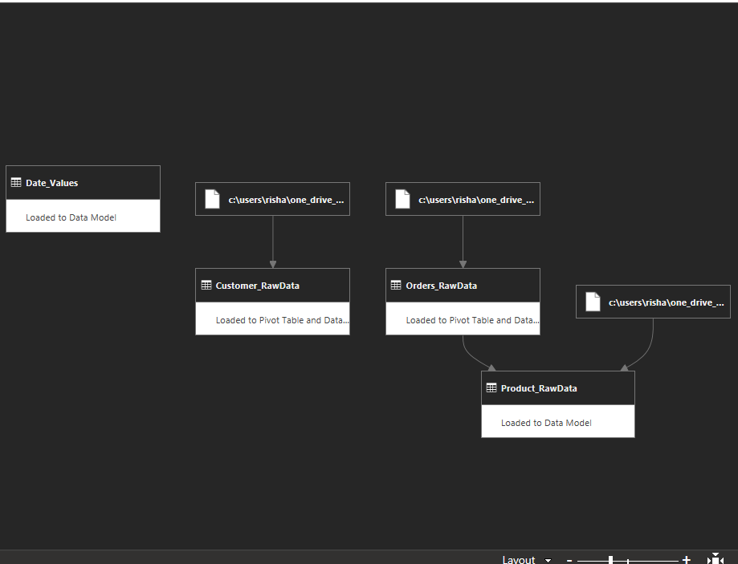

# Business Performance Dashboard
## Overview

This project demonstrates how Excel can be used as a full data analysis tool by consolidating messy data, cleaning and transforming it with Power Query, modeling with Power Pivot, and building an interactive dashboard for business insights.

## Dataset

The project uses three raw input tables to simulate a small-scale retail environment:

**1. Customer Data** (`Customer_RawData.xlsx`)

- Columns: Customer ID, First Name, Last Name, Address, Feedback (0–5 scale)
- Contains basic customer details and satisfaction feedback

**2. Orders Data** (`Orders_RawData.xlsx`)

- Columns: Order ID, Order Date, Customer ID, Address, Product ID, Order Amount, Salesman ID, Ship Method, State.

**3. Product Data** (`Product_RawData.xlsx`)

- Columns: Product ID, Product Name, Product Cost, Item Category, Item Name, Qty in Inventory.
### Notes on Data Quality
 Data is intentionally imperfect to mimic real-world scenarios:
    
    - Duplicate customer records
        
    - Inconsistent text fields (e.g., trailing spaces in names, non-numeric values in cost)
        
    - Missing or poorly formatted entries
        
These issues made the **data cleaning and transformation** stage meaningful, as Power Query was used to standardize types, fix errors, and merge datasets into a consistent model.

## Workflow

**Step 1: Data Cleaning & Preparation (Power Query)**

- Imported multiple raw files and consolidated them into a single clean dataset

- Removed duplicates, fixed data types, and standardized text
- Created calculated fields (Profit, Margin, Month-Year)
.png)
- Loaded into the Data Model for scalable analysis

**Step 2: Modeling & Measures (Power Pivot & DAX)**
- Designed a star schema with relationships across tables

.png)
- Created measures such as Total Revenue, Profit, ARPU (Average Revenue per Unit/Customer)
- Applied DAX time-based calculations 
.png)

**Step 3: Analysis & Forecasting**
- Used PivotTables and PivotCharts for multi-dimensional analysis (by region, category, salesperson, etc.)
- Applied **Forecast Sheet** to project future revenue trends
- Used **Scenario Manager** to explore what-if cases (e.g., price changes, sales volume increases)

**Step 4: Dashboard Creation**
- Built an interactive dashboard with KPIs, trend lines, bar and pie charts
- Added slicers and timeline filters for dynamic exploration
.png)
- Applied conditional formatting for quick insight into growth/decline areas

## Insights
### **Descriptive Insights

The data tells a clear story about our historical performance. Our overall revenue reached **$21,504** across **100 orders**, with an impressive ARPU of **$458**. The business had its strongest year in **2016** with a peak of **$8,645** in revenue, though we saw a notable decline in 2018. From a regional perspective, **California ($4,608)** and **Pennsylvania ($2,834)** were the top-performing states, while a few others contributed only marginally to the total. On a product level, **Furniture** emerged as the top revenue-generating category, bringing in around **$12,000**, while the **Technology** category underperformed. Finally, our sales team's efforts were concentrated among four salespeople, with **SL09 and SL011** collectively contributing over half the total order volume.
### **Diagnostic Insights 

Our analysis of customer behavior shows a surprising trend: customers who gave a feedback score of **3** generated the highest revenue, about **$10,232**. This suggests that these customers, despite not giving the highest scores, are our most engaged and valuable segment. The data also reveals a key risk: a small group of **top customers** is responsible for a significant share of our total revenue. This concentration is an important finding, as it highlights our reliance on a few key relationships.
## Skills Demonstrated
- Data cleaning & transformation with **Power Query**
- Data modeling with **Power Pivot**
- Calculated measures with **DAX**
- Interactive reporting with **PivotTables & PivotCharts**
- Forecasting and scenario analysis with Excel tools
- Dashboard design & visualization
